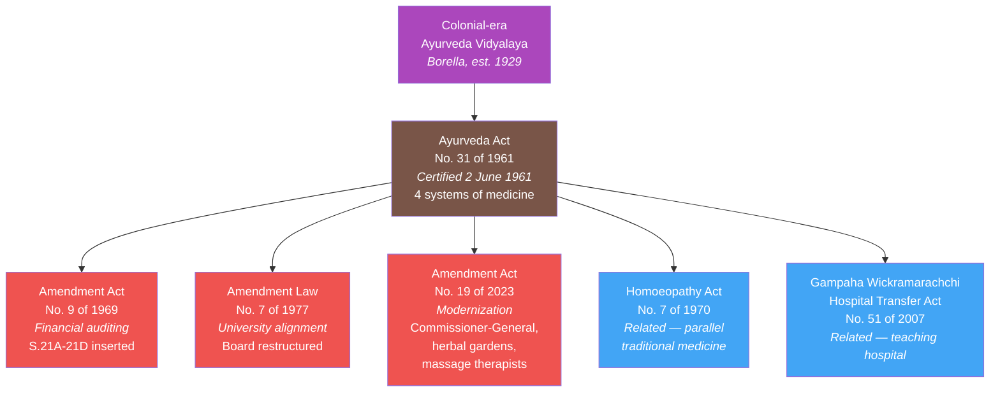
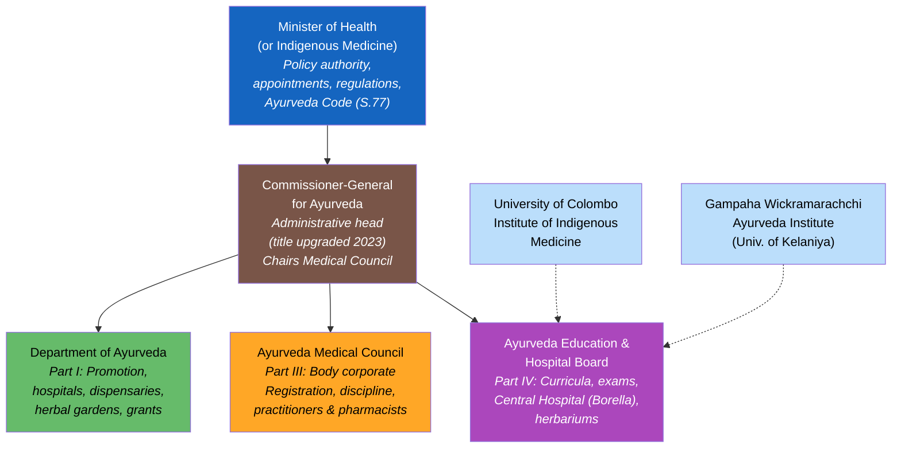
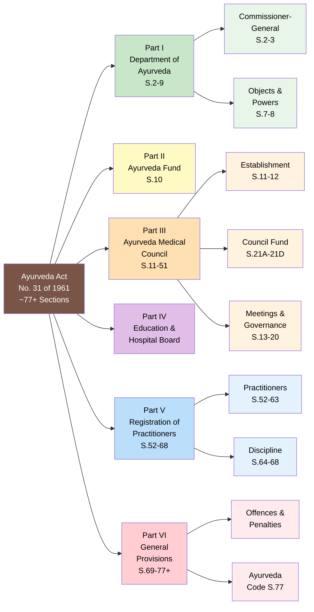
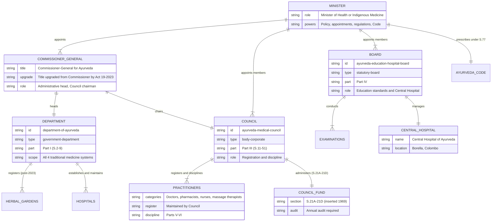

# Ayurveda Act — Lineage & Amendments

The **Ayurveda Act, No. 31 of 1961** is the foundational legislation for the regulation and development of traditional medicine in Sri Lanka. It covers four distinct systems of indigenous medicine: **Ayurveda**, **Siddha**, **Unani**, and **Desiya Chikitsa**. Enacted just 13 years after independence, it established a comprehensive institutional framework — a government department, a professional council, and an education board — that remains active over six decades later.

## Act Overview

The Act created three statutory bodies: the **Department of Ayurveda** (headed by a Commissioner, now Commissioner-General), the **Ayurveda Medical Council** (for practitioner registration and discipline), and the **Ayurveda Education and Hospital Board** (for education standards and the Central Hospital). It has been amended three times — in 1969 (financial auditing), 1977 (university alignment), and 2023 (comprehensive modernization).

**Legend:** 🟤 Principal Act | 🔴 Amendment | 🔵 Related Act | 🟣 Predecessor

### Source Documents

| Act / Instrument | Year | Source | Link |
|:---|:---|:---|:---|
| Ayurveda Act No. 31 of 1961 | 1961 | Parliament of Sri Lanka | [PDF](https://www.parliament.lk/uploads/acts/gbills/english/3939.pdf) |
| Amendment Act No. 9 of 1969 | 1969 | Source TBD | — |
| Amendment Law No. 7 of 1977 | 1977 | Source TBD | — |
| Amendment Act No. 19 of 2023 | 2023 | Parliament of Sri Lanka | [PDF](https://www.parliament.lk/uploads/acts/gbills/english/6301.pdf) |

:::note Three Amendments in 62 Years
The Ayurveda Act has been remarkably stable — only three amendments over more than six decades. The 2023 amendment was the most significant, modernizing a framework largely unchanged since the 1970s.
:::

## Governance Hierarchy

The Act creates a three-pronged institutional structure under the Minister, all coordinated through the Commissioner-General for Ayurveda.

**Legend:** 🔵 Minister | 🟤 Commissioner-General | 🟢 Department | 🟠 Council | 🟣 Board | Light blue = affiliated university institutions | Dashed = academic/advisory link

## Act Structure

The Act is organized into **six Parts** covering the Department, a dedicated fund, the Medical Council, the Education and Hospital Board, registration of practitioners, and general provisions.

**Legend:** 🟤 Principal Act | 🟢 Part I — Department | 🟡 Part II — Fund | 🟠 Part III — Council | 🟣 Part IV — Board | 🔵 Part V — Registration | 🔴 Part VI — General

## Entity-Relationship Diagram

