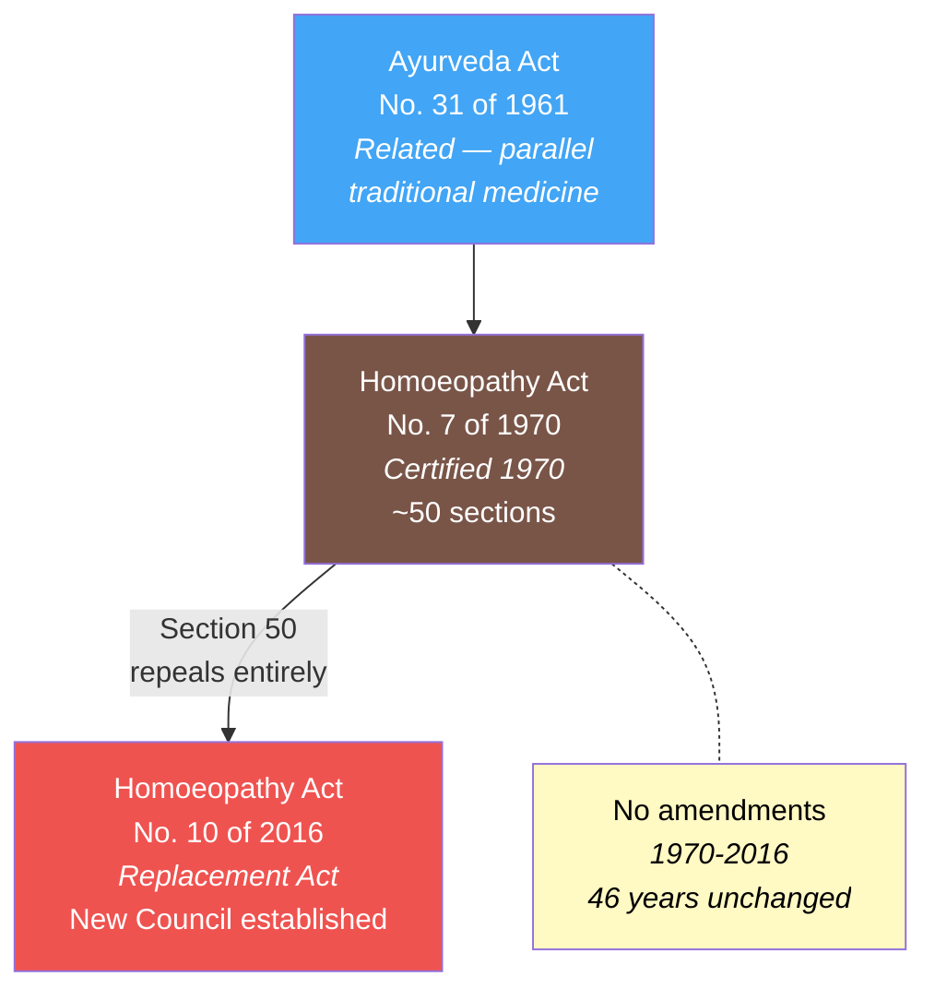
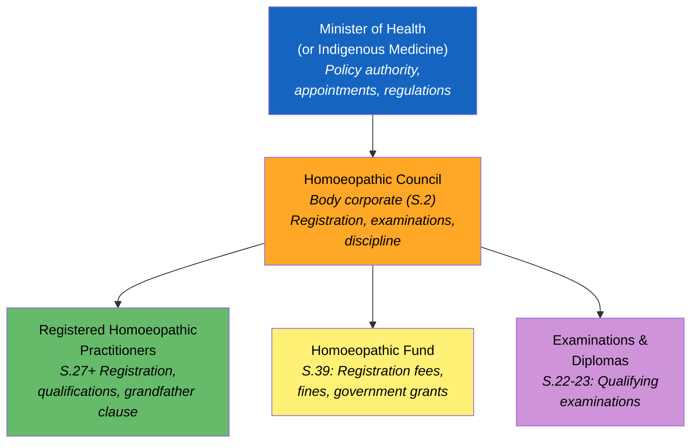
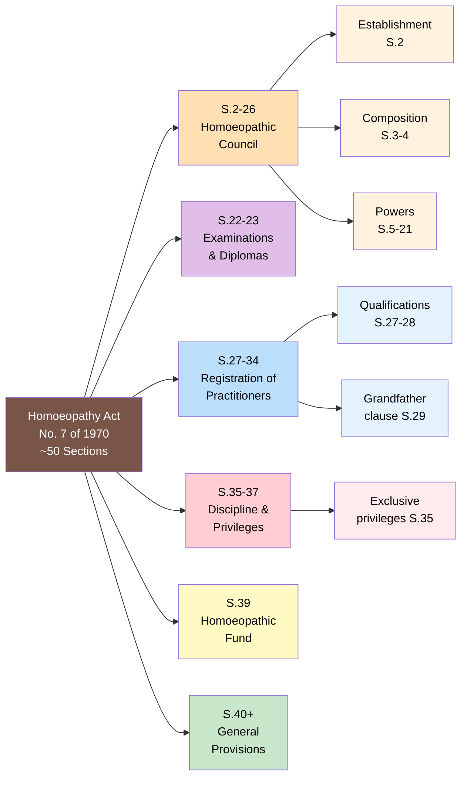
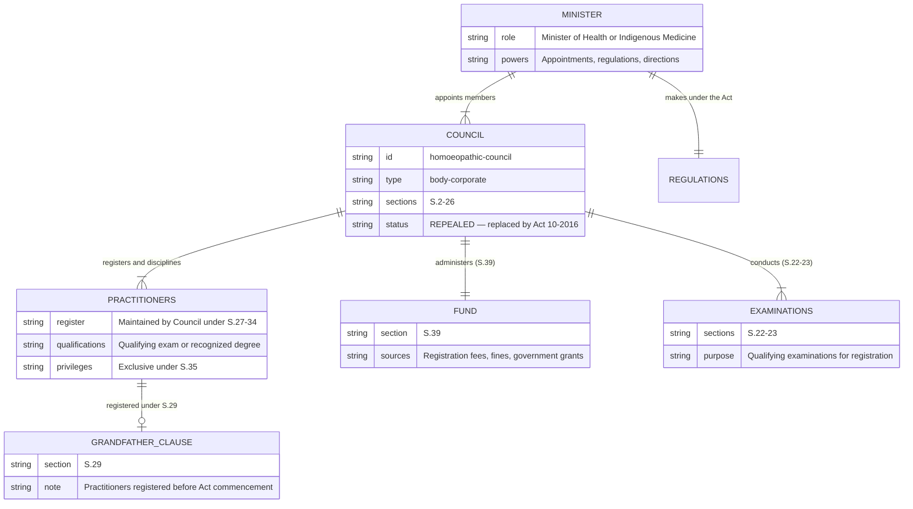

# Homoeopathy Act — Lineage & Amendments

The **Homoeopathy Act, No. 7 of 1970** was enacted to provide for the registration and regulation of homoeopathic practitioners in Sri Lanka. It established the **Homoeopathic Council** as a body corporate and created a registration framework for practitioners. The Act was **never amended** and was **repealed in its entirety** by Section 50 of the **Homoeopathy Act, No. 10 of 2016** after 46 years.

:::danger Repealed Act
This Act was **repealed** by Section 50 of the Homoeopathy Act, No. 10 of 2016. The entire legislative framework — including the Homoeopathic Council, registration system, and Homoeopathic Fund — was replaced by the 2016 Act.
:::

## Act Overview

The 1970 Act created a single statutory body — the **Homoeopathic Council** — responsible for practitioner registration, examinations, and discipline. Unlike the Ayurveda Act (which established three bodies), the Homoeopathy Act had a simpler structure reflecting the smaller homoeopathic community. The Act was cross-referenced with the **Ayurveda Act, No. 31 of 1961** as a parallel framework for alternative medicine regulation.

**Legend:** 🟤 Principal Act (repealed) | 🔴 Replacement Act | 🔵 Related Act | 🟡 Note

### Source Documents

| Act / Instrument | Year | Source | Link |
|:---|:---|:---|:---|
| Homoeopathy Act No. 7 of 1970 | 1970 | Lanka Law | [HTML](https://lankalaw.net/wp-content/uploads/2025/02/1970Y0V0C7A.html) |
| Homoeopathy Act No. 10 of 2016 (replacement) | 2016 | documents.gov.lk | [PDF](https://documents.gov.lk/view/acts/2016/7/10-2016_E.pdf) |

:::note Zero Amendments in 46 Years
The Homoeopathy Act was never amended during its entire 46-year lifespan. Rather than being incrementally updated, it was replaced wholesale by the 2016 Act — a rare approach in Sri Lankan legislative practice, likely motivated by the administrative collapse of the original Homoeopathic Council.
:::

## Governance Hierarchy

The Act created a simple two-tier governance structure under the Minister, centred on the Homoeopathic Council.

**Legend:** 🔵 Minister | 🟠 Council (body corporate) | 🟢 Practitioners | 🟡 Fund | 🟣 Examinations

## Act Structure

The Act is organized into approximately **50 sections** covering the Council, examinations, registration, discipline, the Fund, and general provisions.

**Legend:** 🟤 Principal Act | 🟠 Council | 🟣 Examinations | 🔵 Registration | 🔴 Discipline | 🟡 Fund | 🟢 General

## Entity-Relationship Diagram

