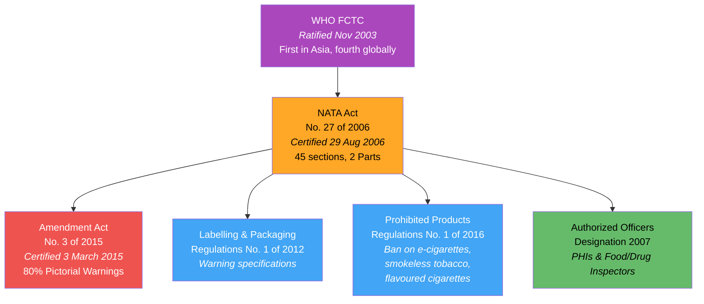
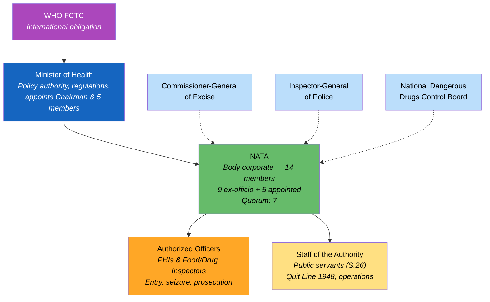
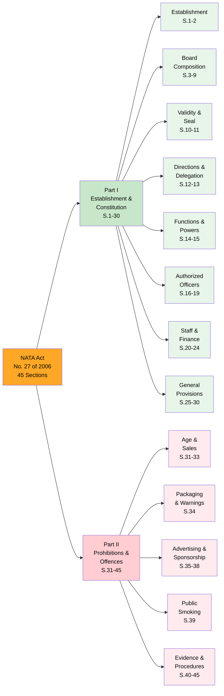
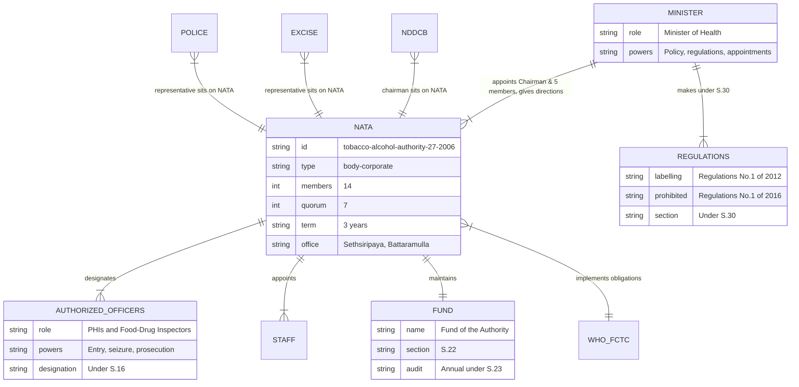

# National Authority on Tobacco and Alcohol Act — Lineage & Amendments

The **National Authority on Tobacco and Alcohol Act, No. 27 of 2006** was enacted to establish **NATA** — a powerful central authority to combat the public health crisis caused by tobacco and alcohol. Sri Lanka was the **first Asian country** and fourth globally to ratify the WHO Framework Convention on Tobacco Control (FCTC) in 2003, and this Act is the primary legislative instrument for meeting those international obligations.

## Act Overview

The Act creates a body corporate (NATA) with 14 members drawn from 6 government ministries, law enforcement, drug control, and ministerially-appointed experts. It introduced groundbreaking prohibitions for the region, including a sale ban to under-21s, a comprehensive advertising ban, and a public smoking ban. The Act has been amended once — by Act No. 3 of 2015, which mandated 80% pictorial health warnings after a landmark legal battle with the tobacco industry.

**Legend:** 🟠 Principal Act | 🔴 Amendment | 🔵 Subsidiary Legislation | 🟢 Establishment | 🟣 International Treaty

### Source Documents

| Act / Instrument | Year | Source | Link |
|:---|:---|:---|:---|
| NATA Act No. 27 of 2006 | 2006 | NDDCB | [PDF](https://www.nddcb.gov.lk/Docs/acts/NATA%20Act%20English.pdf) |
| NATA Act No. 27 of 2006 | 2006 | LawNet | [HTML](http://www.lawnet.gov.lk/wp-content/uploads/Law%20Site/4-stats_1956_2006/set6/2006Y0V0C27A.html) |
| NATA Act No. 27 of 2006 | 2006 | CommonLII | [HTML](https://www.commonlii.org/lk/legis/num_act/naotaaa27o2006427/) |
| Amendment Act No. 3 of 2015 | 2015 | Parliament of Sri Lanka | [PDF](https://www.parliament.lk/uploads/acts/gbills/english/5969.pdf) |
| Amendment Act No. 3 of 2015 | 2015 | Tobacco Control Laws | [Analysis](https://www.tobaccocontrollaws.org/laws/nata-amdt-no-3-of-2015-sri-lanka) |

:::note One Amendment in 19 Years
The Act has been amended only once — by **Act No. 3 of 2015** — which was a direct response to a court ruling that reduced pictorial health warnings from 80% to 50-60%. The amendment enshrined the 80% requirement in primary legislation.
:::

## Governance Hierarchy

NATA operates under the Minister of Health, with enforcement delivered through designated Authorized Officers (PHIs and Food & Drug Inspectors) who have powers of entry, seizure, and prosecution.

**Legend:** 🔵 Minister | 🟢 NATA (body corporate) | 🟠 Enforcement | 🟡 Staff | Light blue = ex-officio member sources | 🟣 International | Dashed = advisory/membership link

## Act Structure

The Act is organized into **2 Parts** with **45 sections**. Part I establishes the Authority and its powers; Part II creates a comprehensive set of prohibitions and offences.

**Legend:** 🟠 Principal Act | 🟢 Part I — Establishment | 🔴 Part II — Prohibitions

## Entity-Relationship Diagram

