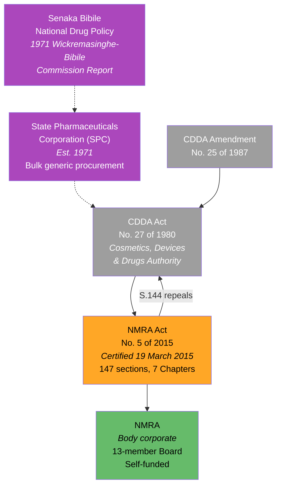
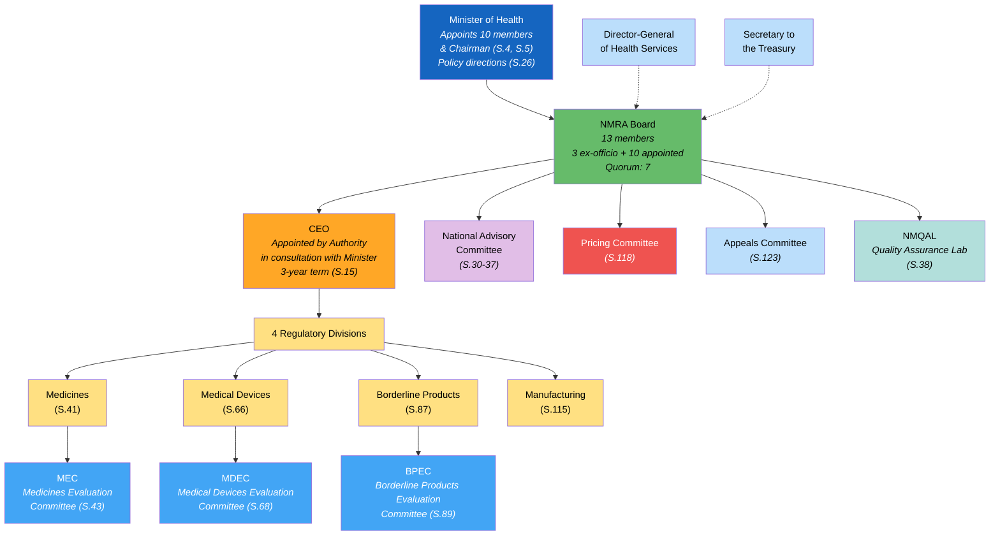
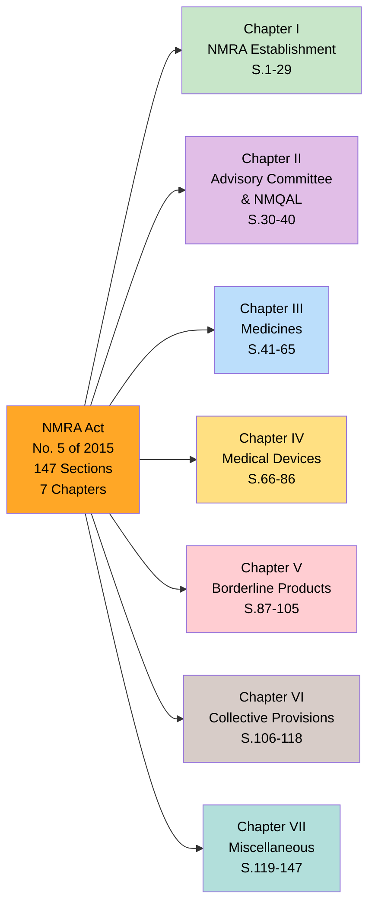
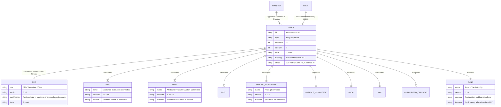

# National Medicines Regulatory Authority Act — Lineage & Amendments

The **National Medicines Regulatory Authority Act, No. 5 of 2015** was certified on **19 March 2015** and commenced on **1 July 2015**. It established the **NMRA** as the successor to the Cosmetics, Devices and Drugs Authority (CDDA), implementing the **Senaka Bibile National Drug Policy** vision of ensuring safe, efficacious medicines at affordable prices. The Act is the most complex piece of health legislation in the Ministry's portfolio — **147 sections** across **7 Chapters**.

## Act Overview

The Act creates NMRA as a self-funded body corporate with a 13-member board. It establishes dedicated regulatory divisions and evaluation committees for medicines, medical devices, and borderline products. It repeals the CDDA Act No. 27 of 1980.

**Legend:** 🟠 Principal Act | 🟢 NMRA (body corporate) | 🟣 Predecessor policy/institution | Gray = Repealed legislation

### Source Documents

| Act / Document | Year | Source | Link |
|:---|:---|:---|:---|
| NMRA Act No. 5 of 2015 | 2015 | LawNet | [HTML](https://www.lawnet.gov.lk/act-no-5-of-2015/) |
| NMRA Act No. 5 of 2015 | 2015 | Sri Lanka Law | [HTML](https://www.srilankalaw.lk/n/1586-national-medicines-regulatory-authority-act.html) |
| NMRA Act No. 5 of 2015 (Full Text) | 2015 | CDN | [PDF](https://cdn.prod.website-files.com/666d0695ca3ba7fa496a5068/66cdaeb3175c53df7e905331_National%20medicines%20regulatory%20authority%20act,%20no.%205%20of%202015%20-%20Eng.pdf) |
| CDDA Act No. 27 of 1980 (repealed) | 1980 | Sri Lanka Law | [PDF](https://www.srilankalaw.lk/YearWisePdf/1980/COSMETICS,%20DEVICES%20AND%20DRUGS%20ACT,%20NO.%2027%20OF%201980.pdf) |
| NMRA Annual Report 2023 | 2023 | Parliament | [PDF](https://parliament.lk/uploads/documents/paperspresented/1712035930031722.pdf) |

:::note No Amendments
The Act has not been amended since enactment. Its operational framework is updated through **Gazette Notifications** and **Regulations** under S.142, including major regulations for medicines, pricing, and clinical trials (2019) and pricing reforms (2025).
:::

## Governance Hierarchy

NMRA has a unique governance model — it is **self-funded** through regulatory fees (no Treasury allocation since 2017), yet subject to ministerial policy direction and parliamentary oversight.

**Legend:** 🔵 Minister | 🟢 NMRA Board | 🟠 CEO | 🟡 Regulatory Divisions | 🔵 Evaluation Committees | 🔴 Pricing | Light blue = Ex-officio/Appeals | Teal = Laboratory | 🟣 Advisory | Dashed = ex-officio link

## Act Structure

The Act is organized into **7 Chapters** with multiple Parts, totalling **147 sections**.

**Legend:** 🟠 Act | 🟢 Ch.I Establishment | 🟣 Ch.II Advisory/Lab | 🔵 Ch.III Medicines | 🟡 Ch.IV Devices | 🔴 Ch.V Borderline | 🟤 Ch.VI Collective | Teal Ch.VII Misc

## Entity-Relationship Diagram

