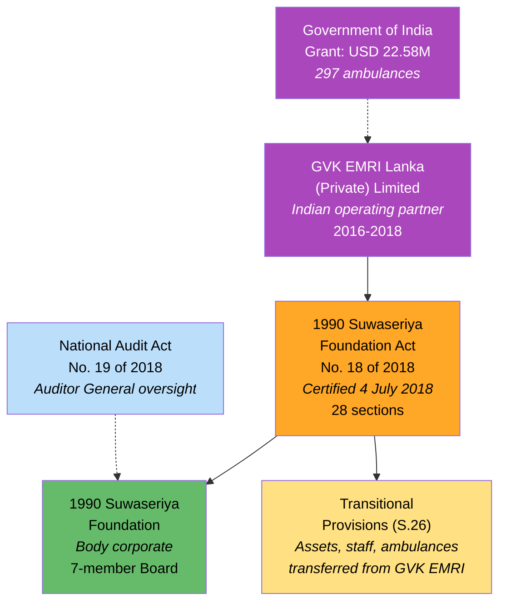
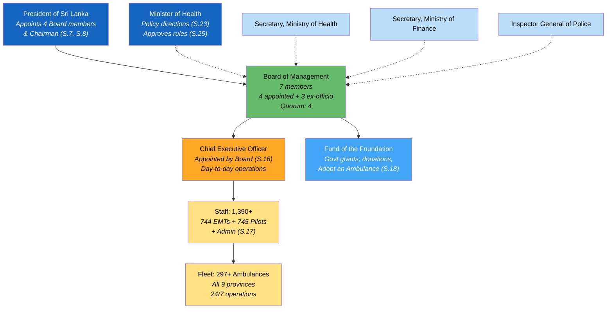
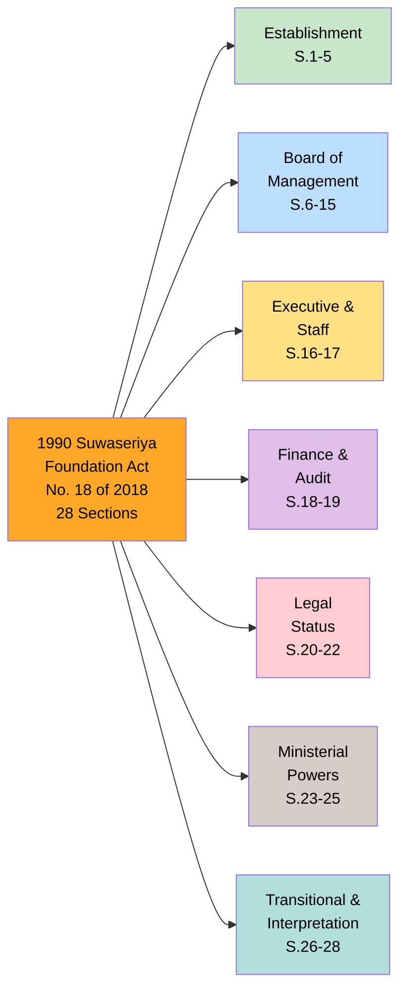
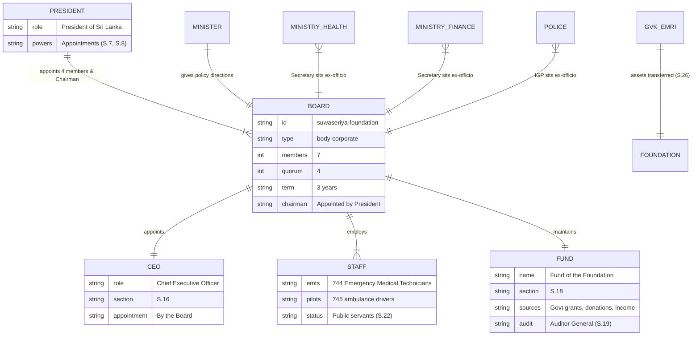

# 1990 Suwaseriya Foundation Act — Lineage & Amendments

The **1990 Suwaseriya Foundation Act, No. 18 of 2018** was certified on **4 July 2018** to formalize Sri Lanka's free emergency ambulance service as a permanent statutory body. The service began in 2016 as a project under **GVK EMRI Lanka (Private) Limited** funded by a **USD 22.58 million Indian Government grant** — the largest Indian grant project in Sri Lanka after the Indian Housing Project. The Act transferred all assets, ambulances, and staff to the new Foundation.

## Act Overview

The Act has **28 sections** and no amendments. It establishes the 1990 Suwaseriya Foundation as a body corporate with a 7-member Board of Management (4 appointed by the President + 3 ex-officio). The Foundation provides **free pre-hospital care** and emergency ambulance services island-wide through 297+ ambulances covering all 9 provinces.

**Legend:** 🟠 Principal Act | 🟢 Foundation (body corporate) | 🟣 Predecessor/Partner | 🟡 Transitional | Light blue = Related legislation | Dashed = advisory/funding link

### Source Documents

| Act / Document | Year | Source | Link |
|:---|:---|:---|:---|
| 1990 Suwaseriya Foundation Act No. 18 of 2018 | 2018 | Government Documents | [PDF](https://documents.gov.lk/view/acts/2018/7/18-2018_E.pdf) |
| 1990 Suwaseriya Foundation Act No. 18 of 2018 | 2018 | Sri Lanka Law | [HTML](https://www.srilankalaw.lk/revised-statutes/volume-vii/1654-suwaeriya-foundation-act.html) |
| Bill as gazetted | 2018 | Government Documents | [PDF](https://documents.gov.lk/view/bills/2018/5/435-2018_E.pdf) |
| Auditor General Report 2023 | 2023 | Auditor General | [PDF](https://auditorgeneral.gov.lk/web/images/audit-reports/upload/2023/State-Corporations/2-iv/1990-Suwaseriya-Foundation--E.pdf) |

:::note No Amendments
The Act has not been amended since enactment in 2018. The Foundation's operations are influenced by administrative changes (portfolio reassignments via gazette notifications) and financial policy decisions, but the primary legislative text remains unchanged.
:::

## Governance Hierarchy

The Foundation has a unique governance structure where the **President** (not the Minister) appoints Board members, while the **Minister of Health** exercises policy direction.

**Legend:** 🔵 Appointing/policy authorities | 🟢 Board (governing body) | 🟠 CEO | 🔵 Fund | 🟡 Operations | Light blue = ex-officio member sources | Dashed = policy direction/membership link

## Act Structure

The Act has **28 sections** covering establishment, governance, operations, finance, and transitional provisions.

**Legend:** 🟠 Act | 🟢 Establishment | 🔵 Governance | 🟡 Operations | 🟣 Finance | 🔴 Legal | 🟤 Ministerial | Teal = Transitional

## Entity-Relationship Diagram

