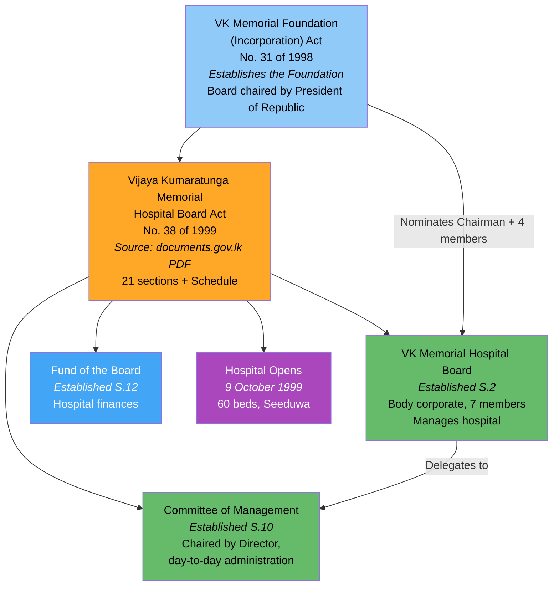
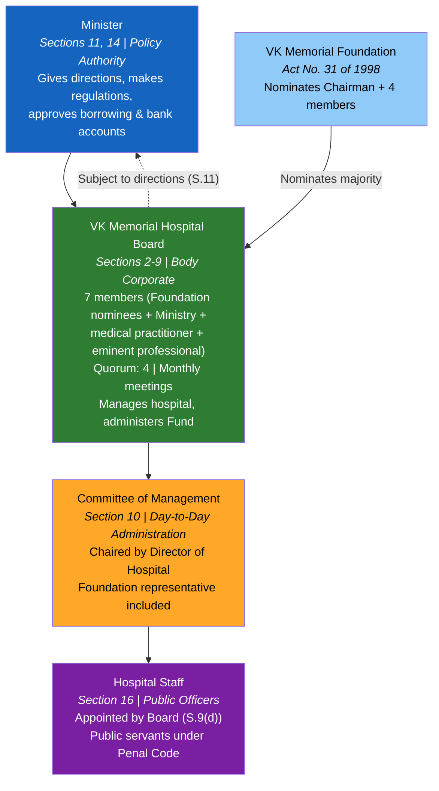
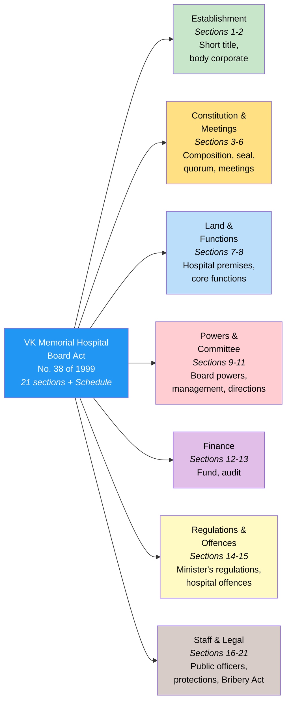
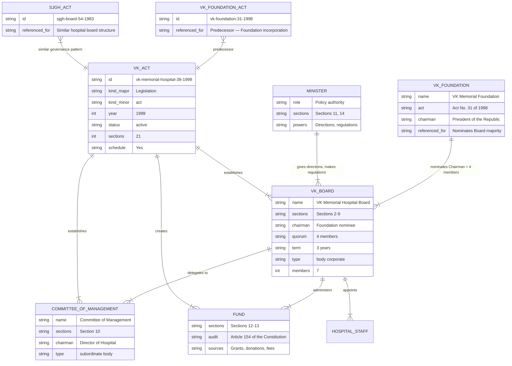

# Vijaya Kumaratunga Memorial Hospital Board Act — Lineage & Amendments

Visual diagrams showing the legislative lineage of the Vijaya Kumaratunga Memorial Hospital Board Act, No. 38 of 1999. This Act establishes the Vijaya Kumaratunga Memorial Hospital Board as a body corporate with perpetual succession, creates a Committee of Management for day-to-day administration, and establishes a dedicated Fund for hospital finances. The hospital at Seeduwa was built in memory of the late actor and politician Vijaya Kumaratunga (1945–1988). No amendments have been enacted since 1999.

## Act Overview

The 1999 Act has no amendments. It was preceded by the VK Memorial Foundation (Incorporation) Act, No. 31 of 1998, which established the Foundation whose nominees form the majority of the Hospital Board.

**Legend:** Light blue = predecessor act, Orange = source available, Green = statutory bodies established, Blue = fund, Purple = operational milestone

### Source Documents

| Act | Year | Source | Link |
|-----|------|--------|------|
| Vijaya Kumaratunga Memorial Hospital Board Act, No. 38 of 1999 | 1999 | documents.gov.lk (PDF) | [View](https://documents.gov.lk/view/acts/1999/11/38-1999_E.pdf) |
| Also available at CommonLII (HTML) | 1999 | commonlii.org | [View](https://www.commonlii.org/lk/legis/num_act/vkmhba38o1999451/) |
| Also available at LawNet (HTML) | 1999 | lawnet.gov.lk | [View](http://www.lawnet.gov.lk/wp-content/uploads/Law%20Site/4-stats_1956_2006/set6/1999Y0V0C38A.html) |
| VK Memorial Foundation (Incorporation) Act, No. 31 of 1998 | 1998 | lawnet.gov.lk | [View](https://www.lawnet.gov.lk/vijaya-kumaratunga-memorial-foundation-incorporation-2/) |

:::note No amendments
This Act has not been amended since enactment in 1999 — over 25 years unamended. Exhaustive search of parliament.lk, documents.gov.lk, and srilankalaw.lk confirmed no amending legislation.
:::

## Governance Hierarchy

The Act creates a four-tier structure. The Minister sets policy and makes regulations. The Board (7 members, quorum 4) manages the hospital as a body corporate. The Committee of Management handles day-to-day administration. Hospital staff are public officers. Uniquely, the VK Memorial Foundation nominates the Chairman and 4 of the 7 Board members, giving the Foundation effective control.

**Legend:** Blue = Minister, Light blue = Foundation, Green = Hospital Board, Orange = Committee of Management, Purple = Hospital Staff

## Act Structure

The Act has 21 sections and a Schedule, organised into 7 functional groups:

## Entity-Relationship Diagram

