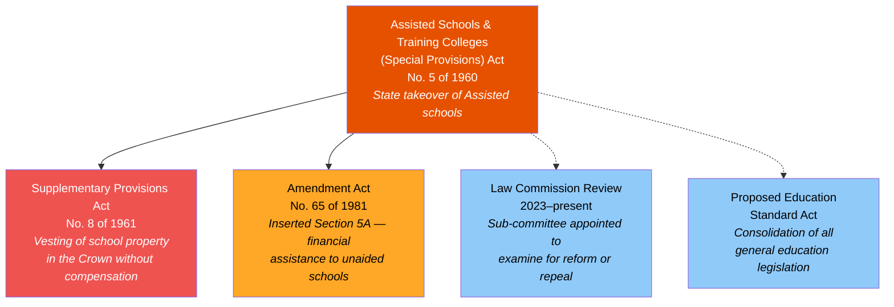
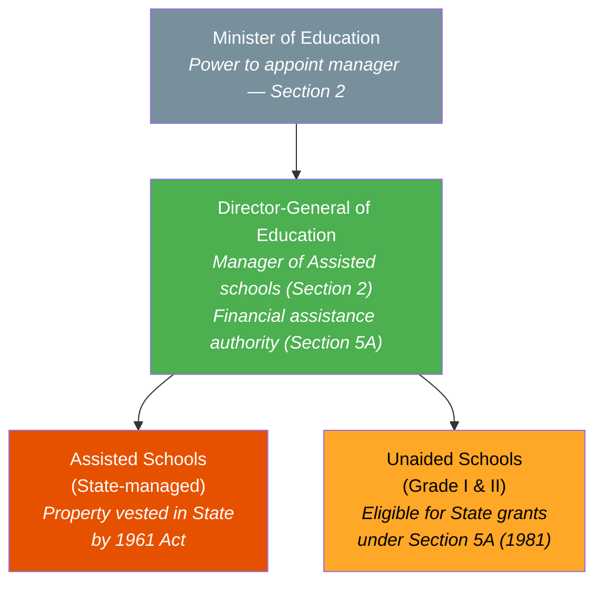
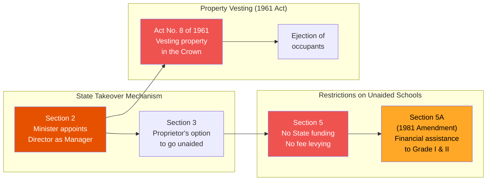
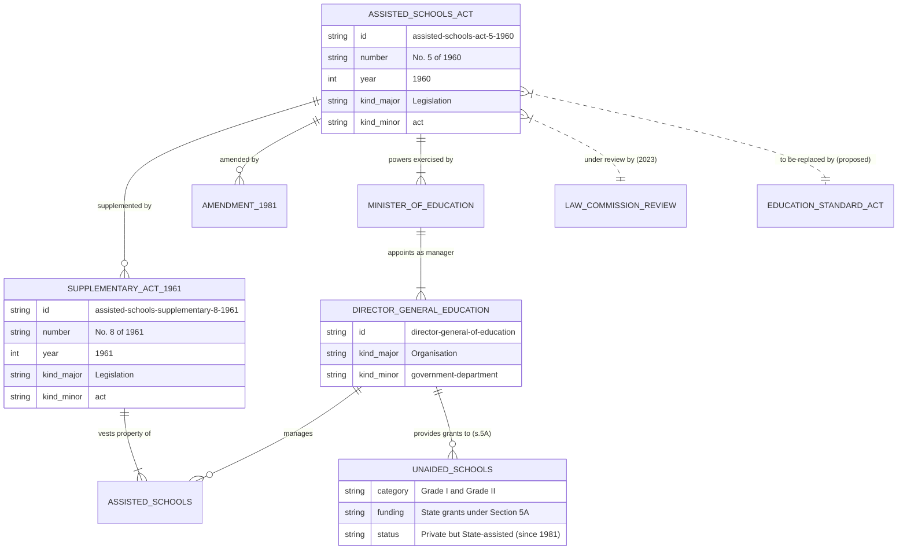

# Assisted Schools and Training Colleges Act — Lineage & Amendments

## Amendment Flowchart

**Legend:** Deep orange = principal act, Red = high-impact supplementary act, Amber = medium-impact amendment, Light blue = pending reform

## Governance Hierarchy

**Legend:** Green = legally active authority, Deep orange = State-managed schools, Amber = unaided schools receiving financial assistance, Gray = reporting target

## Key Sections Overview

## Entity-Relationship Diagram

