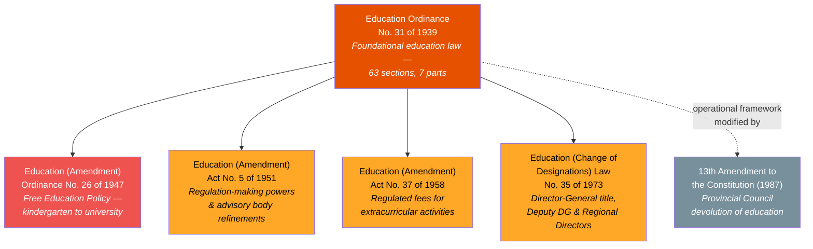
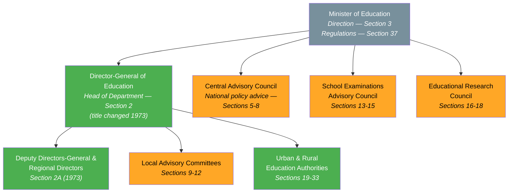
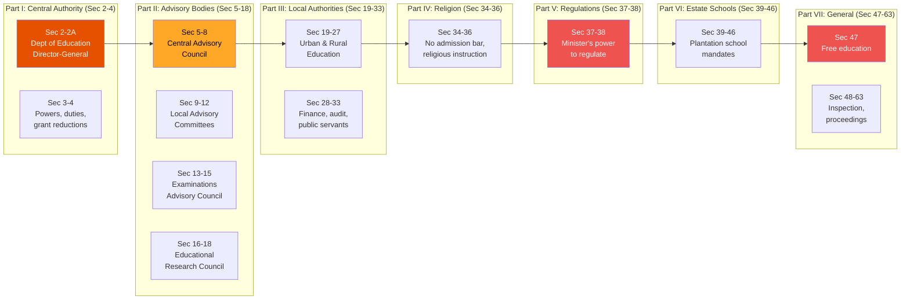
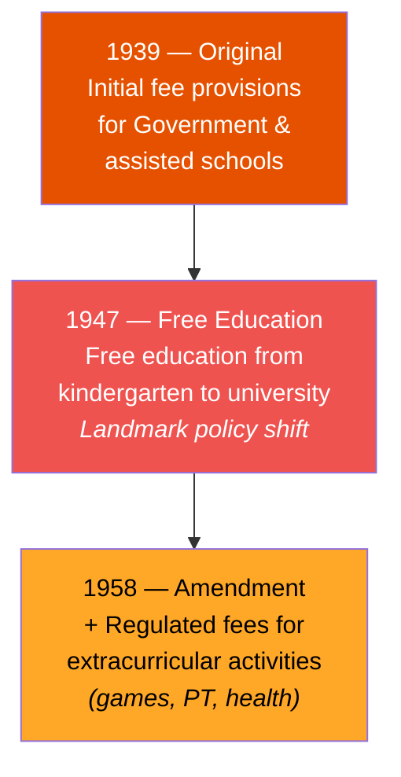
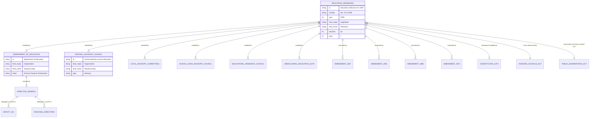

# Education Ordinance — Lineage & Amendments

## Amendment Flowchart

**Legend:** Deep orange = principal ordinance, Red = high-impact amendment, Amber = medium-impact amendment, Gray = constitutional change (not a direct amendment)

## Governance Hierarchy

**Legend:** Green = executive/operational, Amber = advisory body, Gray = oversight/ministerial

## Act Structure (7 Parts)

## Free Education — Section 47 Evolution

## Entity-Relationship Diagram

