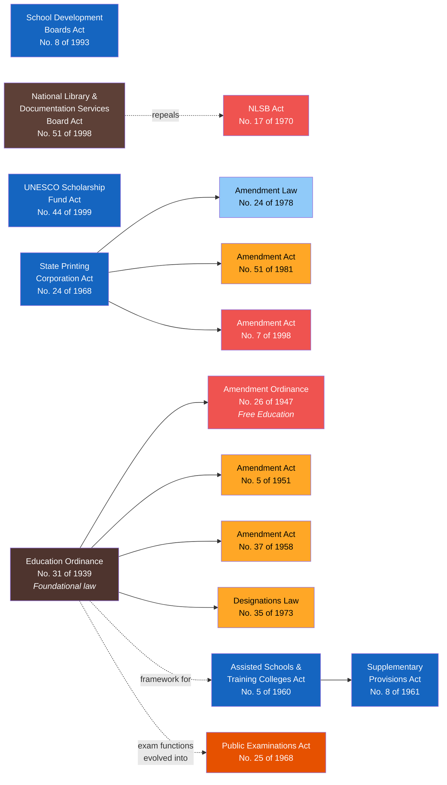

# Act Lineage — Education Ministry

This section maps the amendment history and cross-references between acts assigned to the Minister of Education.

## Cross-Reference Network

:::note
Seven acts/ordinances cataloged so far. The cross-reference network will grow as more Education legislation is added (Universities Act, Pirivena Education Act, etc.).
:::

**Colors by domain:** Orange = Examination & Assessment, Blue = General Education, Purple = Higher Education, Green = Teacher Training, Teal = Technical & Vocational Education, Brown = Library & Documentation, Dark brown = Foundational Framework, Red = Repealed/High-impact amendment

## Act Sources

| Act | Number | Year | Source | Status |
|-----|--------|------|--------|--------|
| Assisted Schools & Training Colleges (Special Provisions) Act | No. 5 of 1960 | 1960 | [LawNet](https://www.lawnet.gov.lk/wp-content/uploads/Law%20Site/4-stats_1956_2006/set1/1960Y0V0C5A.html) | Available |
| Assisted Schools & Training Colleges (Supplementary Provisions) Act | No. 8 of 1961 | 1961 | [LawNet](https://www.lawnet.gov.lk/wp-content/uploads/Law%20Site/4-stats_1956_2006/set1/1961Y0V0C8A.html) | Available |
| Assisted Schools & Training Colleges (Amendment) Act | No. 65 of 1981 | 1981 | [LawNet](https://www.lawnet.gov.lk/wp-content/uploads/Law%20Site/4-stats_1956_2006/set3/1981Y0V0C65A.html) | Available |
| National Library & Documentation Services Board Act | No. 51 of 1998 | 1998 | [natlib.lk (PDF)](http://www.natlib.lk/pdf/51of1998E.pdf) | Available |
| Sri Lanka National Library Services Board Act (REPEALED) | No. 17 of 1970 | 1970 | — | Repealed by No. 51 of 1998 |
| School Development Boards Act | No. 8 of 1993 | 1993 | [CommonLII](http://www.commonlii.org/lk/legis/num_act/sdba8o1993306/) | Available |
| UNESCO Scholarship Fund Act | No. 44 of 1999 | 1999 | [LawNet](https://www.lawnet.gov.lk/wp-content/uploads/cons_stat_up2_2006/1999Y0V0C44A.html) | Available |
| Public Examinations Act | No. 25 of 1968 | 1968 | [srilankalaw.lk](https://www.srilankalaw.lk/revised-statutes/volume-vi/965-public-examinations-act.html) | Partial (paywall) |
| Public Examinations (Amendment) Law | No. 15 of 1976 | 1976 | [lawlanka.com](https://www.lawlanka.com/lal_v2/actShortTitleView;jsessionid=20CD2E46288C5F4BF0394D1ACFC77EF4?selectedAct=1976Y0V0C15A) | Reference only |
| State Printing Corporation Act | No. 24 of 1968 | 1968 | [LawNet](https://www.lawnet.gov.lk/wp-content/uploads/Law%20Site/4-stats_1956_2006/set1/1968Y0V0C24A.html) | Available |
| State Printing Corporation (Amendment) Law | No. 24 of 1978 | 1978 | [CommonLII](https://www.commonlii.org/lk/legis/num_act/spcl24o1978451/) | Available |
| State Printing Corporation (Amendment) Act | No. 51 of 1981 | 1981 | [LawNet](https://lawnet.gov.lk/wp-content/uploads/Law%20Site/4-stats_1956_2006/set3/1981Y0V0C51A.html) | Available |
| State Printing Corporation (Amendment) Act | No. 7 of 1998 | 1998 | [LawNet](https://lawnet.gov.lk/wp-content/uploads/Law%20Site/4-stats_1956_2006/set5/1998Y0V0C7A.html) | Available |
| Education Ordinance | No. 31 of 1939 | 1939 | [srilankalaw.lk](https://www.srilankalaw.lk/e/326-education-ordinance.html) | Available |
| Education (Amendment) Ordinance | No. 26 of 1947 | 1947 | — | Source not confirmed |
| Education (Amendment) Act | No. 5 of 1951 | 1951 | — | Source not confirmed |
| Education (Amendment) Act | No. 37 of 1958 | 1958 | — | Source not confirmed |
| Education (Change of Designations) Law | No. 35 of 1973 | 1973 | — | Source not confirmed |
