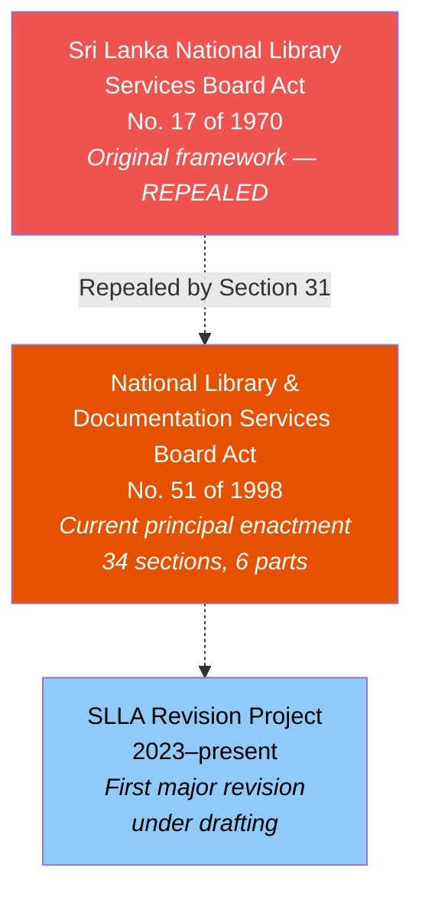
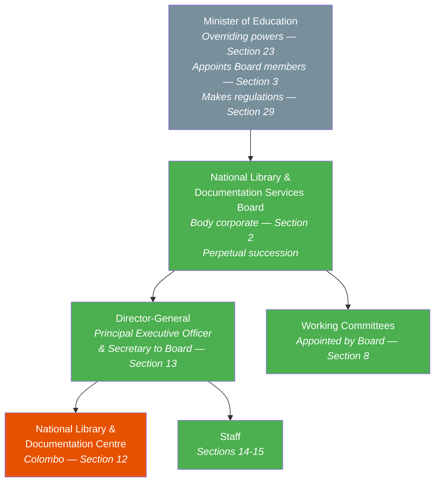
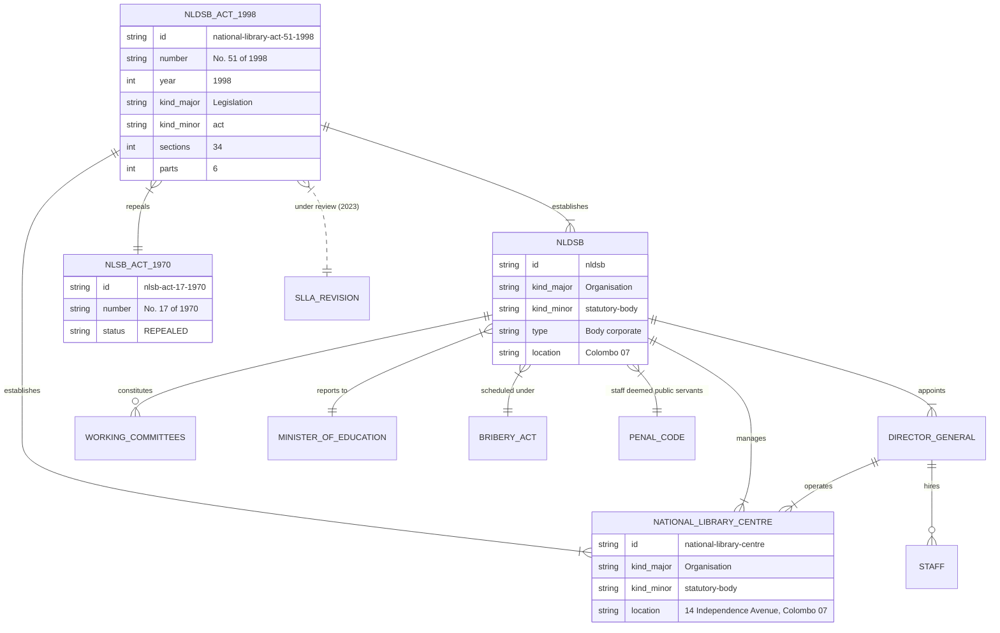

# National Library and Documentation Services Board Act — Lineage & Amendments

## Amendment Flowchart

**Legend:** Deep orange = current principal act, Red = repealed predecessor, Light blue = pending reform

## Governance Hierarchy

**Legend:** Green = legally active, Deep orange = physical institution, Gray = reporting target

## Act Structure (6 Parts)

```mermaid
flowchart LR
    subgraph "Part I: Board"
        S2["Sec 2-3<br/>Establishment<br/>& Constitution"]
        S4["Sec 4-5<br/>Functions<br/>& Powers"]
        S6["Sec 6-11<br/>Admin<br/>Procedures"]
    end

    subgraph "Part II: Centre"
        S12["Sec 12<br/>National Library<br/>Centre"]
    end

    subgraph "Part III: Staff"
        S13["Sec 13-18<br/>Director-General<br/>& Staff"]
    end

    subgraph "Part IV: Finance"
        S19["Sec 19-22<br/>Capital, Fund<br/>Audit"]
    end

    subgraph "Part V: General"
        S23["Sec 23-30<br/>Minister, Land<br/>Bribery Act"]
    end

    subgraph "Part VI: Repeal"
        S31["Sec 31-34<br/>Repeal 1970 Act<br/>Transitional"]
    end

    S2 --> S4 --> S6
    S6 --> S12
    S12 --> S13
    S13 --> S19
    S19 --> S23
    S23 --> S31

    style S2 fill:#E65100,color:#fff
    style S12 fill:#E65100,color:#fff
    style S13 fill:#4CAF50,color:#fff
    style S19 fill:#FFA726,color:#000
    style S23 fill:#78909C,color:#fff
    style S31 fill:#EF5350,color:#fff
```

## Entity-Relationship Diagram

