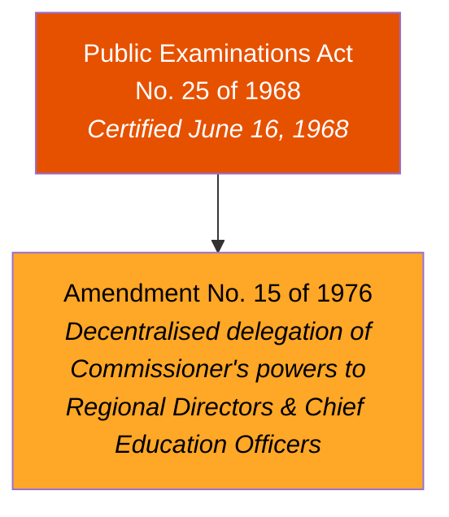
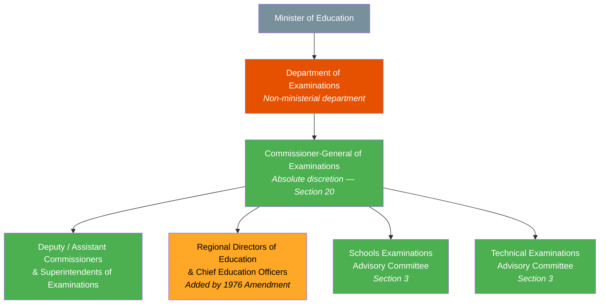
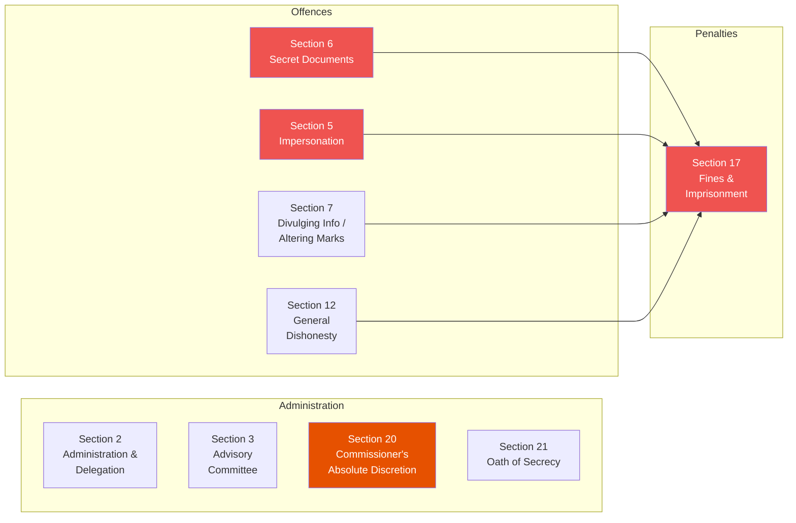
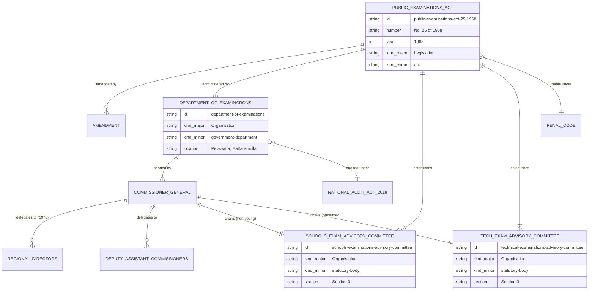

# Public Examinations Act — Lineage & Amendments

## Amendment Flowchart

**Legend:** Orange = principal act, Amber = medium-impact amendment

## Governance Hierarchy

**Legend:** Green = legally active, Orange = added by amendment, Gray = reporting target

## Key Sections Overview

## Entity-Relationship Diagram

