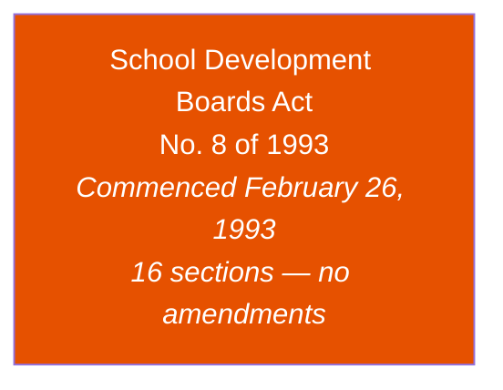
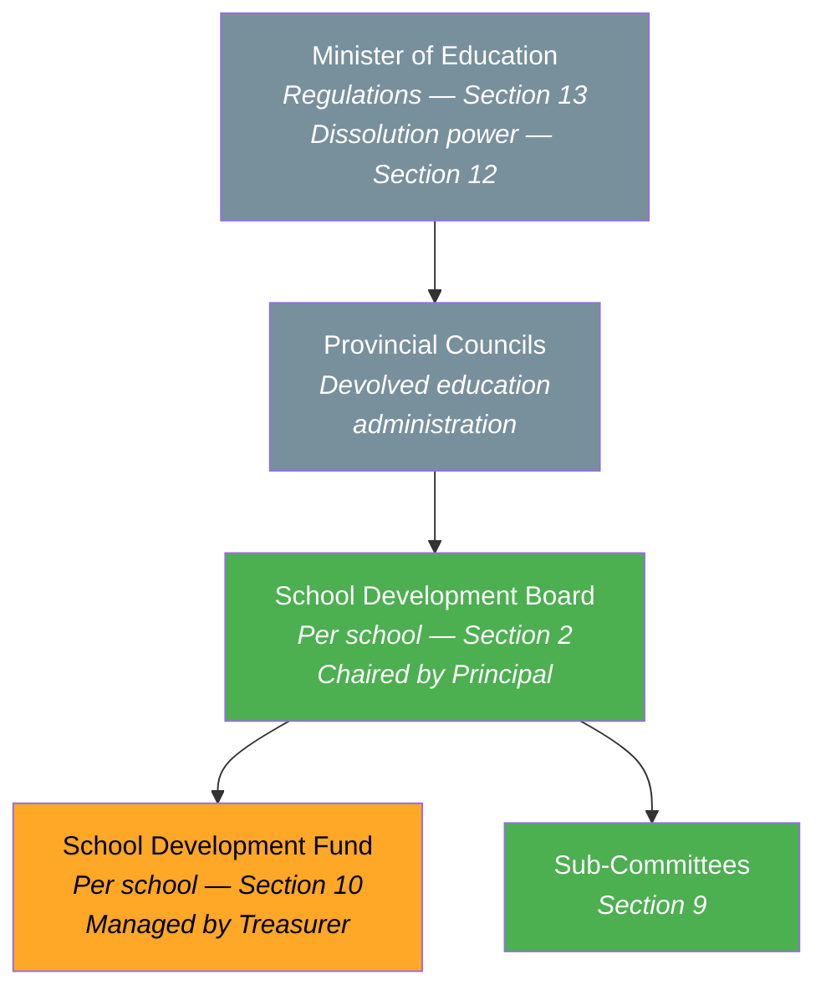
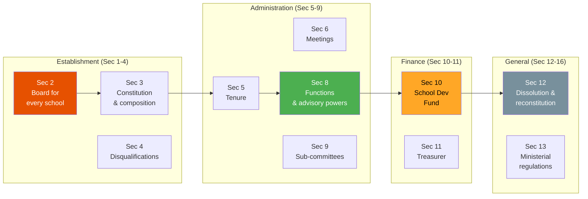
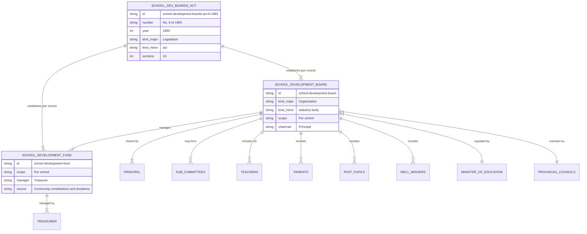

# School Development Boards Act — Lineage & Amendments

## Amendment Flowchart

**Legend:** Deep orange = principal act (no amendments enacted since 1993)

:::note No Amendments
The Act has never been amended by Parliament in over 30 years. However, the Minister may issue operational regulations under Section 13 via government gazettes.
:::

## Governance Hierarchy

**Legend:** Green = legally active, Amber = financial mechanism, Gray = oversight authority

## Key Sections Overview

## Entity-Relationship Diagram

