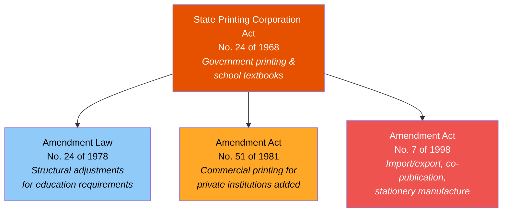
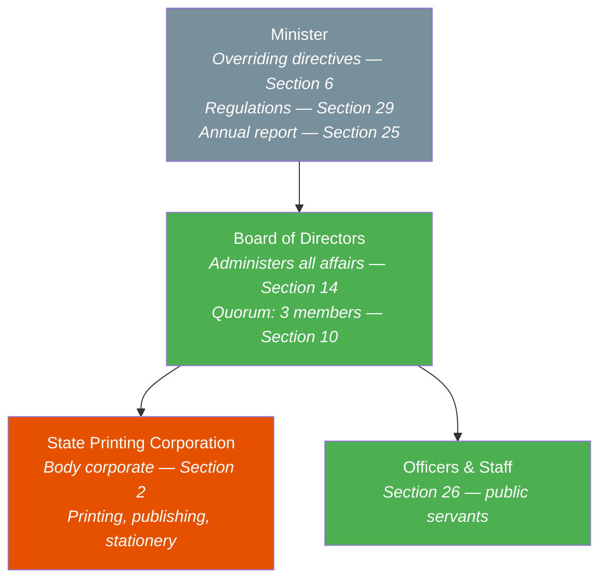
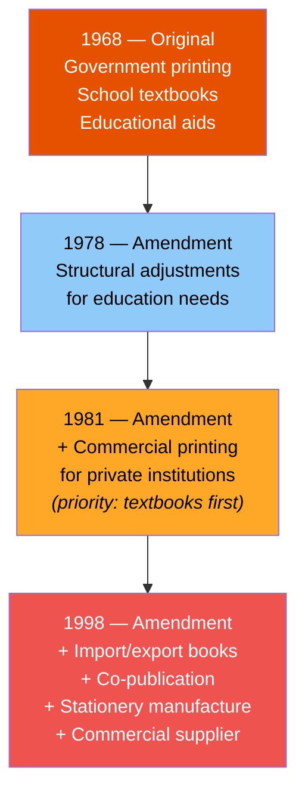
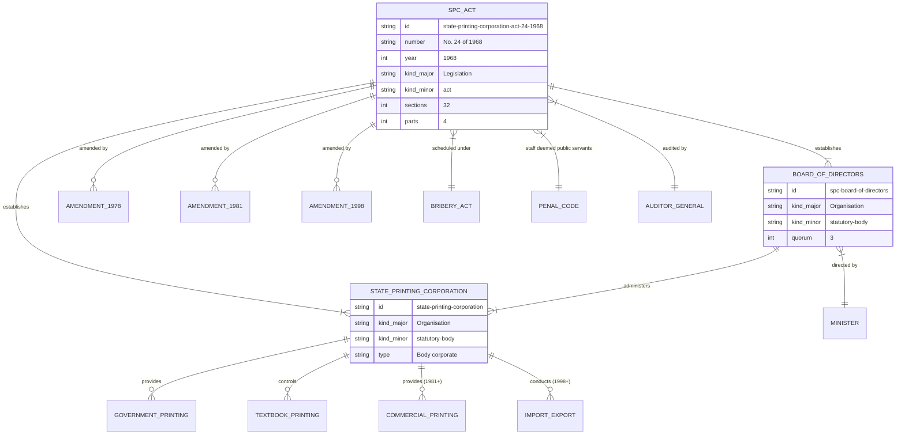

# State Printing Corporation Act — Lineage & Amendments

## Amendment Flowchart

**Legend:** Deep orange = principal act, Light blue = low-impact amendment, Amber = medium-impact amendment, Red = high-impact amendment

## Governance Hierarchy

**Legend:** Green = legally active, Deep orange = corporate entity, Gray = oversight

## Act Structure (4 Parts)

## Evolution of Section 4 (General Objects)

## Entity-Relationship Diagram

