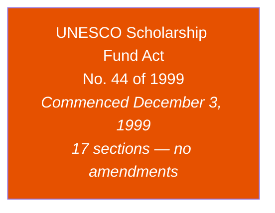
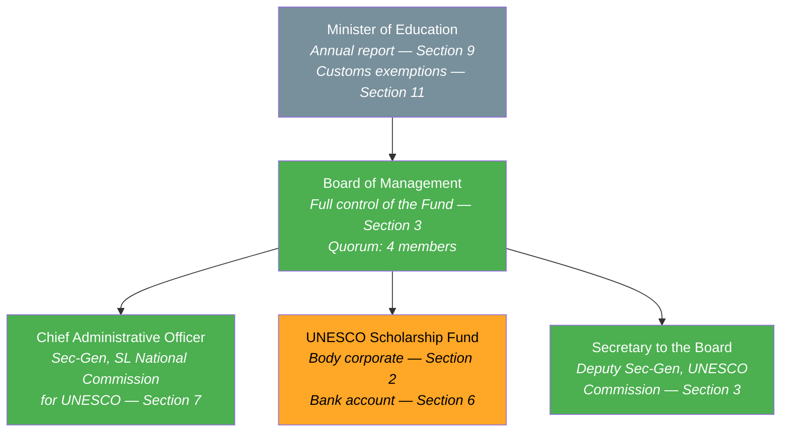
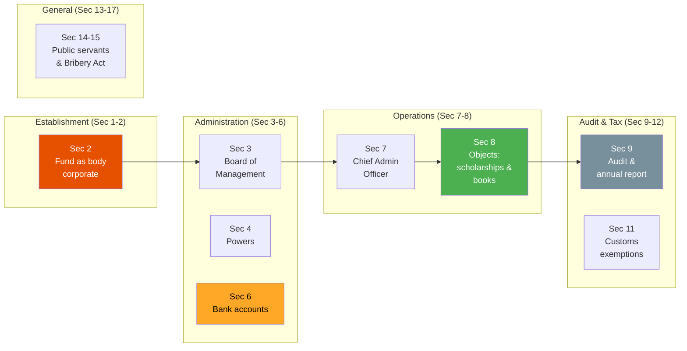
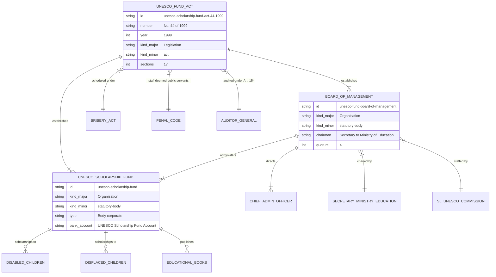

# UNESCO Scholarship Fund Act — Lineage & Amendments

## Amendment Flowchart

**Legend:** Deep orange = principal act (no amendments enacted since 1999)

:::note No Amendments
The Act has never been amended by Parliament in over 25 years. As an administrative shell establishing a financial board and fund, it does not contain the type of complex regulatory language that typically requires frequent amendment.
:::

## Governance Hierarchy

**Legend:** Green = legally active authority, Amber = financial mechanism, Gray = oversight

## Board Composition

## Key Sections Overview

## Entity-Relationship Diagram

